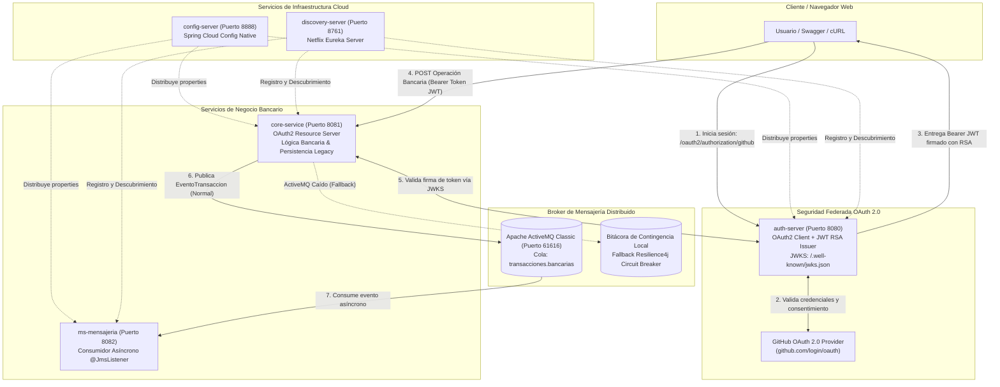

# Banco XYZ - Arquitectura Cloud Resiliente, OAuth 2.0 (GitHub + JWT RSA), Docker y Orquestación con Spring Cloud

### Asignatura: Desarrollo Backend III (PBY2203)
**Profesor:** Marcelo Zepeda  
**Estudiantes:** Carolina Delgado 

---

## 1. Descripción General del Proyecto

El sistema distribuido del **Banco XYZ** implementa una arquitectura backend moderna, desacoplada y orientada a eventos, diseñada para entornos Cloud productivos, con altos estándares de seguridad y tolerancia a fallos.

El ecosistema integra los siguientes componentes de ingeniería:
* **Seguridad con OAuth 2.0 y JWT:** El microservicio `auth-server` delega la autenticación de usuarios en GitHub como proveedor de identidad OAuth 2.0. Tras la autorización, emite tokens de acceso JSON Web Token (JWT) autofirmados con un par de claves asimétricas RSA (algoritmo RS256).
* **Servidor de Recursos (Resource Server):** El microservicio `core-service` valida de forma descentralizada las firmas de los tokens JWT entrantes mediante el endpoint público de claves `/.well-known/jwks.json` expuesto por `auth-server`, blindando las operaciones contables (retiros y transferencias).
* **Mensajería Asíncrona (JMS):** Separación estricta entre productor (`core-service`) y consumidor asíncrono (`ms-mensajeria`) a través del broker de mensajería **Apache ActiveMQ Classic** sobre la cola persistente `transacciones.bancarias`.
* **Tolerancia a Fallos (Resilience4j):** Protección en la publicación de eventos mediante patrones Circuit Breaker y Retry. Ante una eventual caída o degradación del broker, el sistema activa automáticamente un fallback de contingencia local sin interrumpir la operación bancaria del usuario.
* **Contenerización y Orquestación Cloud:** Todos los microservicios cuentan con su respectivo `Dockerfile` y están orquestados mediante un archivo unificado `docker-compose.yml` que gestiona redes privadas (`banco-net`) y variables de entorno protegidas (`.env`).

---

## 2. Diagrama de Arquitectura de la Solución



---

## 3. Matriz de Microservicios, Puertos y Endpoints

| Microservicio | Puerto Host | Descripción y Rol | Endpoints Clave |
| :--- | :---: | :--- | :--- |
| **`config-server`** | `8888` | Servidor centralizado de configuración nativa (`config-repo`) | `GET http://localhost:8888/core-service/default`<br>`GET http://localhost:8888/auth_server/default` |
| **`discovery-server`** | `8761` | Servidor Eureka para descubrimiento y registro de servicios | `http://localhost:8761` *(admin / eureka2026)* |
| **`auth-server`** | `8080` | Servidor de Autorización OAuth 2.0 y emisor JWT RSA | `http://localhost:8080/oauth2/authorization/github`<br>`http://localhost:8080/.well-known/jwks.json`<br>`http://localhost:8080/api/auth/login` |
| **`core-service`** | `8081` | Servidor de Recursos protegido con lógica de cuentas, retiros y transferencias | `http://localhost:8081/swagger-ui.html`<br>`POST http://localhost:8081/api/core/operaciones/retiro`<br>`POST http://localhost:8081/api/core/operaciones/transferencia`<br>`GET http://localhost:8081/api/core/mensajeria/contingencias` |
| **`ms-mensajeria`** | `8082` | Microservicio consumidor asíncrono JMS | `GET http://localhost:8082/api/mensajeria/historial`<br>`GET http://localhost:8082/actuator/health` |
| **`activemq`** | `61616` / `8161` | Broker de mensajería distribuido Apache ActiveMQ | `tcp://localhost:61616` (JMS OpenWire)<br>`http://localhost:8161/admin` *(admin / admin)* |

---

## 4. Gestión Segura de Credenciales con Variables de Entorno

Siguiendo el estándar **12-Factor App** para evitar la exposición de secretos en el código fuente:

1. El archivo centralizado `config-server/config-repo/auth_server.properties` utiliza variables de entorno:
   ```properties
   spring.security.oauth2.client.registration.github.client-id=${GITHUB_CLIENT_ID:Ov23lib2ztrqPoxNZEe7}
   spring.security.oauth2.client.registration.github.client-secret=${GITHUB_CLIENT_SECRET}
   ```
2. Las credenciales reales se alojan en el archivo `.env` en la raíz del proyecto (excluido del repositorio mediante `.gitignore`).
3. Se incluye el archivo de plantilla `.env.example` para facilitar la configuración en cualquier nuevo entorno de despliegue:
   ```env
   GITHUB_CLIENT_ID=Ov23lib2ztrqPoxNZEe7
   GITHUB_CLIENT_SECRET=tu_secreto_generado_en_github
   ```

---

## 5. Instrucciones de Ejecución y Puesta en Marcha

### Prerrequisitos
* Java 21 JDK instalado
* Maven 3.9+ (o wrapper `./mvnw`)
* Docker y Docker Compose

### Opción 1: Despliegue Completo con Docker Compose

1. **Configurar el archivo `.env`:**
   ```bash
   cp .env.example .env
   # Completar GITHUB_CLIENT_SECRET en .env
   ```

2. **Compilar los microservicios:**
   ```bash
   ./mvnw clean package -DskipTests
   ```

3. **Lanzar la arquitectura completa:**
   ```bash
   docker compose up --build -d
   ```

4. **Verificar el estado de los contenedores:**
   ```bash
   docker compose ps
   ```

---

### Opción 2: Ejecución Local en Entorno de Desarrollo (VS Code / Terminal)

1. **Levantar ActiveMQ:**
   ```bash
   docker compose up -d activemq
   ```
2. **Iniciar los microservicios en el siguiente orden secuencial:**
   1. `ConfigServerApplication` (puerto `8888`)
   2. `DiscoveryServerApplication` (puerto `8761`)
   3. `AuthServerApplication` (puerto `8080`)
   4. `CoreServiceApplication` (puerto `8081`)
   5. `MsMensajeriaApplication` (puerto `8082`)

---

## 6. Procedimiento de Pruebas y Validación Operativa

### Paso 1: Monitoreo en Eureka Server
* Abrir en el navegador: `http://localhost:8761` (Credenciales: `admin` / `eureka2026`).
* Verificar el registro de las instancias:
  * `AUTH_SERVER`
  * `CORE-SERVICE`
  * `MS-MENSAJERIA`

---

### Paso 2: Autenticación OAuth 2.0 y Generación de Token JWT
1. En el navegador web, ingresar a:  
   `http://localhost:8080/oauth2/authorization/github`
2. Iniciar sesión en GitHub si es requerido y presionar **Authorize**.
3. El sistema redirige automáticamente a `http://localhost:8080/login/oauth2/code/github` y retorna el JSON con el token de acceso:
   ```json
   {
     "tokenType": "Bearer",
     "accessToken": "eyJraWQiOiJmOTIz...",
     "expiresIn": 3600,
     "githubUser": "tu-usuario-github",
     "email": "tu-correo@duocuc.cl"
   }
   ```
4. Copiar el valor de `accessToken`.

---

### Paso 3: Validación de Protección en Servidor de Recursos (Sin Token)
Ejecutar una solicitud bancaria a `core-service` sin credenciales:
```bash
curl -i -X POST http://localhost:8081/api/core/operaciones/retiro \
  -H "Content-Type: application/json" \
  -d '{"cuentaId": 1001, "monto": 10000, "canal": "ATM"}'
```
* **Resultado:** `HTTP/1.1 401 Unauthorized` (Acceso denegado por Spring Security).

---

### Paso 4: Ejecución de Operación Bancaria Protegida (Con Token JWT)
Ejecutar la solicitud incluyendo la cabecera `Authorization: Bearer <TOKEN>`:
```bash
curl -i -X POST http://localhost:8081/api/core/operaciones/retiro \
  -H "Content-Type: application/json" \
  -H "Authorization: Bearer <TU_ACCESS_TOKEN>" \
  -d '{"cuentaId": 1001, "monto": 10000, "canal": "ATM"}'
```
* **Resultado:** `HTTP/1.1 200 OK`, retornando el balance actualizado y emitiendo el evento JMS a ActiveMQ.

---

### Paso 5: Verificación de Consumo Asíncrono JMS
Inspeccionar los logs del microservicio de mensajería:
```bash
docker compose logs -f ms-mensajeria
```
* **Resultado:** Se evidencia el procesamiento del evento mediante `@JmsListener`:
  ```text
  [RECEPTOR-JMS] Mensaje recibido exitosamente desde transacciones.bancarias: EventoTransaccion(...)
  ```
* En la consola web de ActiveMQ (`http://localhost:8161/admin/queues.jsp`, credenciales `admin`/`admin`) se refleja el mensaje procesado en la cola `transacciones.bancarias`.

---

### Paso 6: Prueba de Resiliencia y Contingencia (ActiveMQ Caído)
1. Detener el broker de mensajería para simular una falla de infraestructura:
   ```bash
   docker stop activemq
   ```
2. Realizar un nuevo retiro bancario enviando el Bearer Token:
   ```bash
   curl -i -X POST http://localhost:8081/api/core/operaciones/retiro \
     -H "Content-Type: application/json" \
     -H "Authorization: Bearer <TU_ACCESS_TOKEN>" \
     -d '{"cuentaId": 1001, "monto": 15000, "canal": "WEB"}'
   ```
   * **Resultado:** La solicitud responde `200 OK`. La operación bancaria no se cae gracias a la tolerancia a fallos.
3. Consultar los eventos guardados en la bitácora de contingencia:
   ```bash
   curl -X GET http://localhost:8081/api/core/mensajeria/contingencias \
     -H "Authorization: Bearer <TU_ACCESS_TOKEN>"
   ```
   * **Resultado:** El evento no entregado a ActiveMQ queda registrado de forma segura en contingencia local a través del fallback de Resilience4j.
4. Reiniciar el broker:
   ```bash
   docker start activemq
   ```
