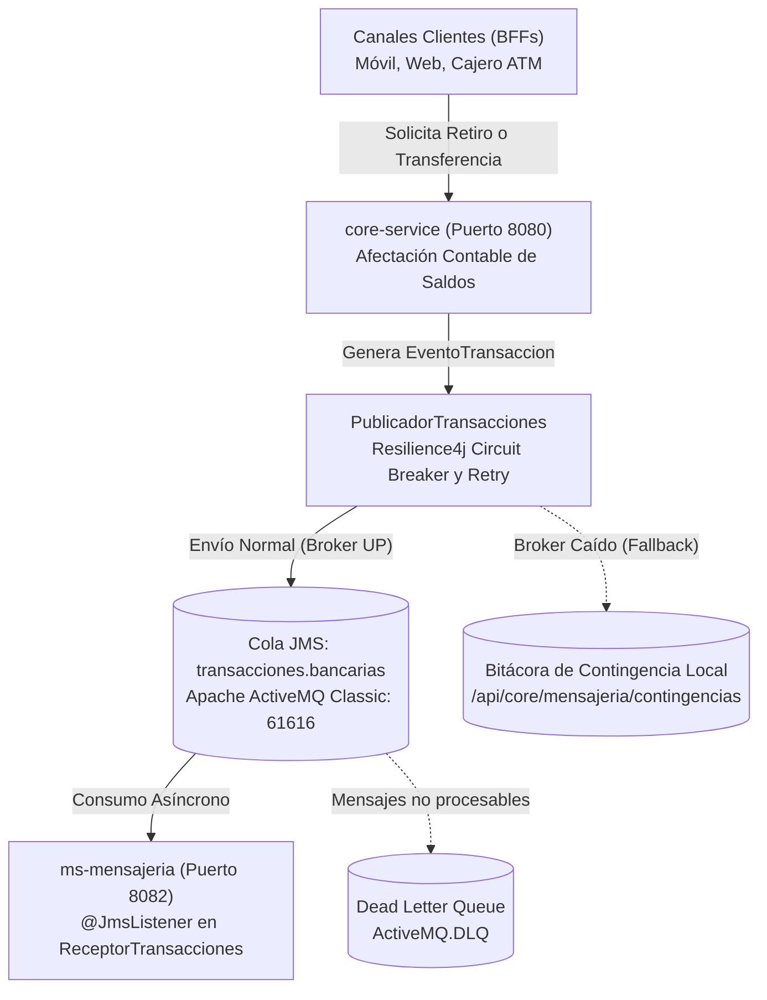

# Banco XYZ - Arquitectura de Eventos Asíncrona con JMS (Apache ActiveMQ) y Tolerancia a Fallos (Resilience4j) en Microservicios Cloud
### Asignatura: Desarrollo Backend III (PBY2203) - Experiencia 3 / Semana 7
**Grupo:** Grupo 3  
**Integrantes:** Leonardo Bustamante - Carolina Delgado Sapunar  
**Repositorio GitHub:** [https://github.com/Lybern/Exp3_S7_Grupo3](https://github.com/Lybern/Exp3_S7_Grupo3)

---

## 1. Descripción del Proyecto y Propuesta Técnica

En continuidad con los microservicios desarrollados en la Semana 6 (Config Server, Eureka, Core Bancario y BFFs de canal), para la **Semana 7** se implementó una **Arquitectura Basada en Eventos (EDA - Event-Driven Architecture) Asíncrona** y **Tolerancia a Fallos sobre la Mensajería**, garantizando desacoplamiento, alta disponibilidad y consistencia eventual en las operaciones financieras del **Banco XYZ**.

### A. Justificación Técnica: Selección del Broker de Mensajería (JMS ActiveMQ vs. Apache Kafka)

Para la solución del Banco XYZ se evaluaron las dos tecnologías requeridas:

| Criterio de Selección | 🏆 JMS (Apache ActiveMQ Classic) | Apache Kafka |
| :--- | :--- | :--- |
| **Modelo de Mensajería** | **Colas Punto a Punto (*Queues*) transaccionales:** Garantiza que cada transacción financiera sea procesada por un único consumidor con confirmación estricta (*acknowledgment*). | **Log de Eventos Distribuido inmutable:** Los eventos persisten en particiones para múltiples consumidores concurrentes mediante *offsets*. |
| **Tolerancia a Fallos y DLQ** | **Nativa (*Out-of-the-box*):** Si un evento transaccional falla repetidamente tras reintentos, el broker lo deriva de forma automática a la cola **`ActiveMQ.DLQ` (Dead Letter Queue)** sin código adicional de infraestructura. | **Manual y Compleja:** Requiere configurar manualmente `DefaultErrorHandler`, `FixedBackOff` y tópicos de sufijo `.DLT` (*Dead Letter Topic*). |
| **Operación e Infraestructura** | **Ligera y Rápida:** Contenedor Docker oficial (`apache/activemq-classic`) que consume menos de 100 MB de RAM y expone una consola web de monitoreo inmediata en el puerto `8161` (`http://localhost:8161/admin`). | **Pesada:** Requiere coordinar clústeres, particiones y metadatos (KRaft o Zookeeper), demandando entre 1 y 2 GB de RAM. |
| **Idoneidad Bancaria (Saga)** | **Altamente idóneo:** La banca transaccional exige consistencia 1 a 1 y entrega garantizada con rollback o descarte controlado. | Idóneo para ingestión masiva de métricas, telemetría o streaming de datos en tiempo real, pero sobredimensionado para transacciones bancarias unitarias. |

> **Decisión Arquitectónica:** Se seleccionó **JMS con Apache ActiveMQ Classic**, asegurando consistencia transaccional y monitoreo visual inmediato.

---

### B. Patrón de Diseño Seleccionado: Saga Coreografiada con Notificación de Eventos (Event Notification) y DLQ

Se implementó el patrón **Saga Coreografiada (*Choreographed Saga*)** complementado con **Event Notification**:
1. **Desacoplamiento Asíncrono:** Cuando un canal cliente (Móvil, Web o Cajero ATM) ejecuta un retiro o transferencia, el `core-service` procesa la afectación contable y emite de forma asíncrona un evento de dominio (`EventoTransaccion`) a la cola JMS `transacciones.bancarias`.
2. **Coreografía:** No existe un orquestador central que genere un cuello de botella. El nuevo microservicio **`ms-mensajeria`** escucha la cola reactivamente mediante `@JmsListener`, registra la trazabilidad de las operaciones y expone la evidencia transaccional.
3. **Doble Capa de Tolerancia a Fallos:**
   - **En el Productor (Resilience4j):** La clase `PublicadorTransacciones` protege la llamada a `JmsTemplate` con `@CircuitBreaker(name = "envioMensajeria")` y `@Retry`. Si ActiveMQ colapsa o no responde, se activa automáticamente el método `fallbackEnvioMensaje`, almacenando el evento en una bitácora local de contingencia (`transaccionesContingencia`) sin interrumpir la operación bancaria del cliente.
   - **En el Broker (Dead Letter Queue):** Mensajes que generen errores irrecuperables en el consumo son desviados a la cola `ActiveMQ.DLQ`.

---

## 2. Diagrama de la Solución de Arquitectura

El siguiente diagrama representa de forma clara y directa la topología de eventos, colas y tolerancia a fallos implementada entre los microservicios:



### Componentes del Flujo:
1. **Emisor (`core-service`):** Procesa la operación bancaria y utiliza `PublicadorTransacciones` para enviar el evento a la cola.
2. **Broker (`ActiveMQ`):** Enruta los mensajes en la cola `transacciones.bancarias` y gestiona la cola de descarte `ActiveMQ.DLQ`.
3. **Receptor (`ms-mensajeria`):** Escucha asíncronamente con `@JmsListener` e imprime en consola la notificación.
4. **Resiliencia (Fallback):** Si ActiveMQ no responde, el Circuit Breaker desvía el mensaje a la bitácora de contingencia sin interrumpir al usuario.

---

## 3. Matriz de Componentes, Puertos y Credenciales

| Componente | Tipo / Rol | Puerto | Protocolo / Seguridad | Responsabilidad Principal |
| :--- | :--- | :---: | :--- | :--- |
| **`activemq`** | Broker Mensajería | `61616` / `8161` | TCP OpenWire / HTTP Admin (`admin`/`admin`) | Broker Apache ActiveMQ Classic desplegado en contenedor Docker. Administra colas y Dead Letter Queue. |
| **`config-server`** | Servidor Config | `8888` | HTTP (Basic Auth: `admin`/`gato`) | Servidor Spring Cloud Config con perfil nativo. Expone propiedades centralizadas desde `config-repo/`. |
| **`discovery-server`** | Registro Eureka | `8761` | HTTP (Basic Auth: `eureka`/`eureka2026`) | Servidor Netflix Eureka para registro y descubrimiento dinámico de microservicios. |
| **`core-service`** | Productor / Core | `8080` | HTTP (Service Token) | Microservicio transaccional. Publica eventos a ActiveMQ con `PublicadorTransacciones`, `@CircuitBreaker`, `@Retry` y Fallback. |
| **`ms-mensajeria`** | Consumidor JMS | `8082` | HTTP (Público / Interno) | Microservicio receptor asíncrono con `@JmsListener`, parser Jackson y catálogo de eventos REST. |
| **`bff-movil`** | BFF Canal Móvil | `8443` | HTTPS / PKCS12 + JWT (`aud: MOVIL`) | BFF optimizado para móviles (transferencias, top movimientos). Resiliencia con Circuit Breaker hacia Core. |
| **`bff-web`** | BFF Canal Web | `8444` | HTTPS / PKCS12 + JWT (`aud: WEB`) | BFF web con dashboard consolidado y cálculo de intereses anuales. |
| **`bff-cajero`** | BFF Cajero ATM | `8445` | HTTPS / PKCS12 + JWT (`aud: ATM`) | BFF para dispensación física de cajeros automáticos en múltiplos de $5.000 con validación de PIN. |

---

## 4. Tolerancia a Fallos sobre la Mensajería (Resilience4j)

Tal como se enfatizó en la sesión sincrónica, la resiliencia no se limita al transporte HTTP, sino que **protege directamente la infraestructura de eventos asíncronos**:

* **Instancia:** `envioMensajeria` (configurada centralmente en `config-repo/core-service.properties`).
* **Ventana Deslizante (`slidingWindowSize`):** 10 llamadas.
* **Tasa de Umbral de Fallos (`failureRateThreshold`):** 50%.
* **Tiempo en Estado Abierto (`waitDurationInOpenState`):** 10.000 ms (10 segundos).
* **Llamadas permitidas en Half-Open:** 3 llamadas.
* **Reintentos automáticos (`resilience4j.retry`):** 3 intentos con 1.000 ms de backoff entre fallas transitorias.
* **Comportamiento Degradado (Fallback Contingente):**
  * Si el broker ActiveMQ se apaga o la conexión TCP falla, la excepción no aborta la transacción contable.
  * El método `fallbackEnvioMensaje` intercepta el evento, le asigna el estado `"CONTINGENCIA_PENDIENTE_BROKER"`, lo registra en los logs de advertencia y lo resguarda en una bitácora de contingencia accesible vía endpoint REST (`GET /api/core/mensajeria/contingencias`).

---

## 5. Instrucciones de Compilación y Puesta en Marcha

### Prerrequisitos:
* **Java:** OpenJDK 21 (LTS) o superior.
* **Maven:** Incluido mediante `./mvnw` / `mvnw.cmd`.
* **Docker:** Docker Desktop o Docker Engine (para el contenedor de ActiveMQ).

---

### Paso 1: Iniciar el Broker de Mensajería Apache ActiveMQ

Ejecutar mediante `docker-compose.yml` provisto en la raíz del proyecto:
```bash
docker compose up -d
```
O mediante el comando Docker directo enseñado en clase:
```bash
docker run -d --name activemq -p 61616:61616 -p 8161:8161 apache/activemq-classic:latest
```
* **Consola de Administración Web:** [http://localhost:8161/admin](http://localhost:8161/admin)  
  *Usuario:* `admin` | *Contraseña:* `admin`

---

### Paso 2: Compilar el Proyecto Multi-Módulo
```bash
./mvnw clean test-compile
```

---

### Paso 3: Orden de Inicio Secuencial de los Microservicios

Abrir terminales independientes y ejecutar los servicios en el siguiente orden:

1. **Terminal 1 - Iniciar Config Server (Puerto 8888):**
   ```bash
   ./mvnw -pl config-server spring-boot:run
   ```

2. **Terminal 2 - Iniciar Discovery Server Eureka (Puerto 8761):**
   ```bash
   ./mvnw -pl discovery-server spring-boot:run
   ```
   *Dashboard Eureka:* [http://localhost:8761](http://localhost:8761) (Credenciales: `eureka` / `eureka2026`)

3. **Terminal 3 - Iniciar Core Service (Puerto 8080 - Productor JMS):**
   ```bash
   ./mvnw -pl core-service spring-boot:run
   ```

4. **Terminal 4 - Iniciar MS-Mensajería (Puerto 8082 - Consumidor JMS):**
   ```bash
   ./mvnw -pl ms-mensajeria spring-boot:run
   ```

5. **Terminal 5 - Iniciar BFF Móvil (Puerto HTTPS 8443):**
   ```bash
   ./mvnw -pl bff-movil spring-boot:run
   ```

6. **Terminal 6 - Iniciar BFF Web (Puerto HTTPS 8444):**
   ```bash
   ./mvnw -pl bff-web spring-boot:run
   ```

7. **Terminal 7 - Iniciar BFF Cajero ATM (Puerto HTTPS 8445):**
   ```bash
   ./mvnw -pl bff-cajero spring-boot:run
   ```

---

## 6. Pruebas y Evidencias de Ejecución (Postman & Consola)

### A. Matriz de Endpoints para Verificación de Eventos

| Servicio | Método | Endpoint | Descripción | Resultado Esperado |
| :--- | :---: | :--- | :--- | :--- |
| **BFF Cajero** | `POST` | `https://localhost:8445/api/v1/cajero/cuentas/101/retiro` | Ejecutar retiro físico en cajero ATM | Descuenta saldo en Core y emite evento JMS `RETIRO` a la cola |
| **BFF Móvil** | `POST` | `https://localhost:8443/api/v1/movil/cuentas/106/transferencia` | Ejecutar transferencia electrónica de fondos | Modifica saldos y emite evento JMS `TRANSFERENCIA` a la cola |
| **MS-Mensajería** | `GET` | `http://localhost:8082/api/mensajeria/eventos` | Consultar eventos recibidos asíncronamente desde ActiveMQ | Lista de transacciones con IDs, montos, fecha y canal |
| **Core Service** | `GET` | `http://localhost:8080/api/core/mensajeria/contingencias` | Consultar eventos en contingencia por Circuit Breaker | Registros resguardados cuando ActiveMQ está caído o inaccesible |
| **ActiveMQ** | `GET` | `http://localhost:8161/admin/queues.jsp` | Consola Web de ActiveMQ | Visualización de mensajes encolados y dequeued en `transacciones.bancarias` |

---

### B. Procedimiento de Prueba de Eventos Normales (ActiveMQ Arriba)

1. Autenticarse en el BFF Móvil (`POST https://localhost:8443/api/auth/login`) con credenciales `usuario_movil` / `movil123` y obtener el token JWT.
2. Realizar una transferencia desde Postman:
   * **URL:** `https://localhost:8443/api/v1/movil/cuentas/106/transferencia`
   * **Header:** `Authorization: Bearer <TOKEN_JWT>`
   * **Body JSON:**
     ```json
     {
       "cuentaDestinoId": 107,
       "monto": 25000,
       "comentario": "Pago de servicios compartidos"
     }
     ```
3. **Evidencia en Consola del Core Service (`8080`):**
   ```text
   [PUBLICADOR-JMS] Publicando evento transaccional 'TX-4F2A1BC8' en la cola 'transacciones.bancarias'
   [PUBLICADOR-JMS] Transacción 'TX-4F2A1BC8' publicada con éxito en broker ActiveMQ
   ```
4. **Evidencia en Consola de MS-Mensajería (`8082`):**
   ```text
   ===============================================================
   [MS-MENSAJERIA] EVENTO RECIBIDO DESDE ACTIVEMQ
   ID Transacción: TX-4F2A1BC8
   Tipo Operación: TRANSFERENCIA
   Canal:          MOVIL
   Monto:          $25000
   Cuenta Origen:  106
   Cuenta Destino: 107
   Estado:         EXITOSA
   Fecha/Hora:     2026-09-27T04:55:00
   Detalle:        Pago de servicios compartidos
   ===============================================================
   ```
5. **Verificación REST:** Consultar `http://localhost:8082/api/mensajeria/eventos` para visualizar el catálogo consolidado de eventos recibidos por mensajería.

---

### C. Procedimiento de Prueba de Tolerancia a Fallos (ActiveMQ Caído)

1. **Detener el broker de mensajería:**
   ```bash
   docker stop activemq
   ```
2. Realizar una operación de retiro en el BFF Cajero o transferencia en el BFF Móvil.
3. **Resultado:**
   * La operación bancaria **NO falla**, retornando respuesta exitosa al cliente.
   * El Circuit Breaker y Retry de Resilience4j en `core-service` capturan la imposibilidad de conectar a `tcp://localhost:61616`.
   * Se ejecuta automáticamente el método `fallbackEnvioMensaje`:
     ```text
     [FALLBACK RESILIENCE4J] ActiveMQ no disponible o circuito ABIERTO. Causa: Connection refused
     [FALLBACK RESILIENCE4J] Guardando evento 'TX-9B1C3D7E' en contingencia local. Total pendientes: 1
     ```
4. **Verificación REST:** Consultar `http://localhost:8080/api/core/mensajeria/contingencias` para confirmar que el evento quedó resguardado en la bitácora de contingencia sin pérdidas de información.

---

## 7. Documentación Swagger / OpenAPI

* 📱 **BFF Móvil:** `https://localhost:8443/swagger-ui/index.html`
* 🌐 **BFF Web:** `https://localhost:8444/swagger-ui/index.html`
* 🏧 **BFF Cajero:** `https://localhost:8445/swagger-ui/index.html`
* 🏢 **Core Service:** `http://localhost:8080/swagger-ui/index.html`
* 📨 **MS-Mensajería:** `http://localhost:8082/swagger-ui/index.html`
* 🩺 **Actuator Health & Metrics:** `http://localhost:8080/actuator/health`, `http://localhost:8082/actuator/health`
